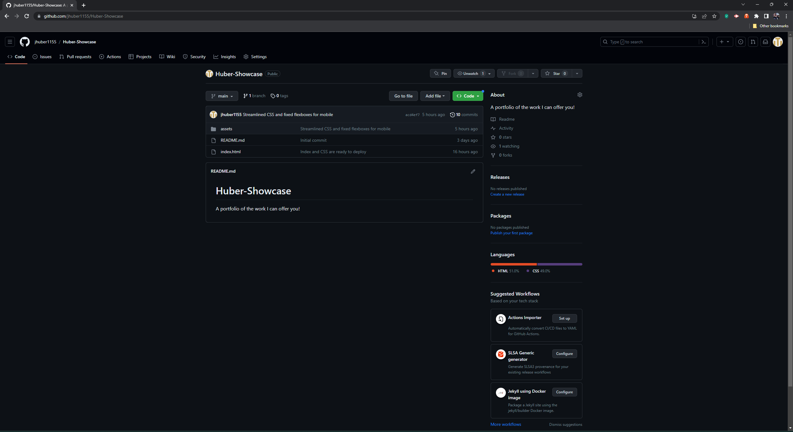
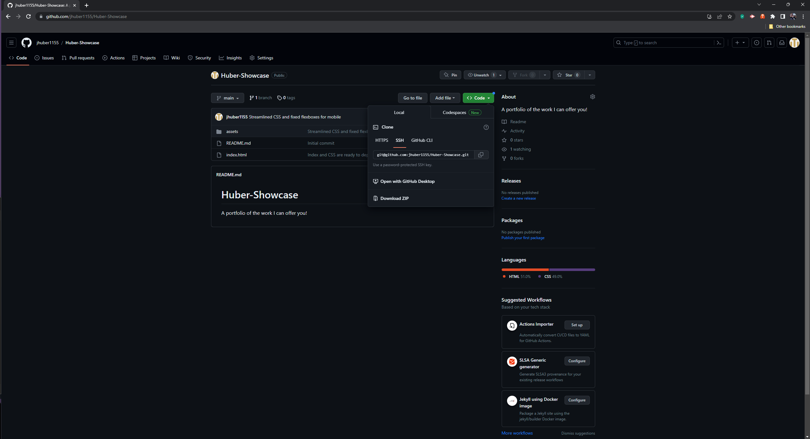
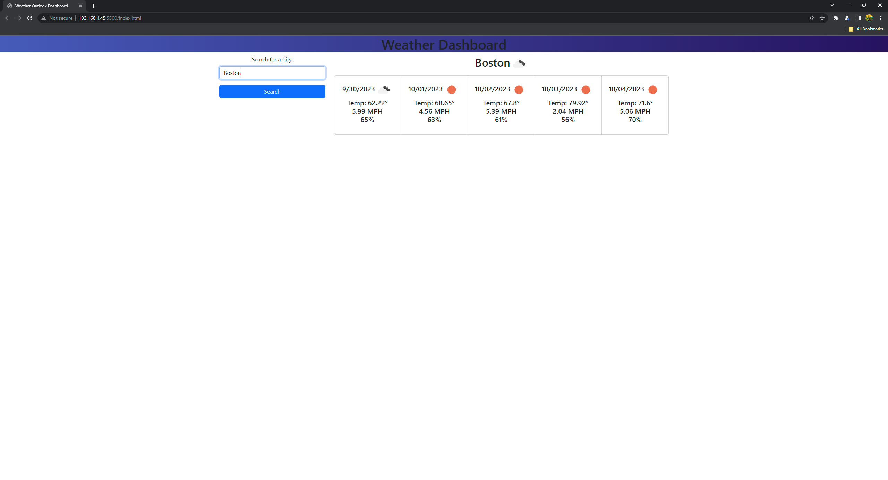

# Weather-5Day-Outlook

## Description

The motivation behind this project was to create an easy 5-day calendar outlook for a city which you might be travelling to. This project was supposed to showcase our ability to pull API calls and use the data in a meaningful way which we can use in future applications. This particular problem will help you determine if you need to bring an umbrella or avoid a hurricane, or any manner of weather you may encounter on a business trip or family vacation.

I learned about API calls and how to integrate the data I recieve by itterating through arrays to pull the corresponding data that I need to make my program/application

## Installation

Go to (Github.com)(www.github.com)

Clone the repo code with the green button

Open the code with your code editor and run the index.html

Enter the name of the city you wish to know the current weather and 5 day forcast of.

Enter a new city name to learn the weather of another city. Click one of the previous city buttons to learn of the weather of a city you previously searched.

## Credits

UCLA bootcamp Instructors and students.
